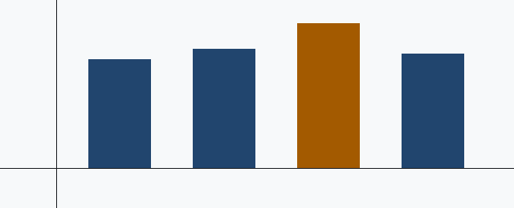

# Executive summary

The group completed the year with a stable cost base and an improved capital position.
Throughput increased in three of the four regions, while the cost per transaction
decreased by 6.4 per cent.

Two conditions limit the conclusions. First, the reconciliation of the Southern region
ledger was not complete at the reporting date.[^1]

[^1]: The Southern region ledger reconciliation was 94 per cent complete at the
reporting date. The residual difference is 1.2 million.

::: {custom-style="Lead"}
Recommendation: approve the second phase of the platform migration and release the
contingency reserve of 12.4 million.
:::

## Method and scope

The analysis covers all entities consolidated at 31 August 2026.

### Data sources

Three systems supplied the primary records. Manual adjustments are identified with the
marker `ADJ-` followed by the sequence number.

#### Reconciliation procedure

Each regional controller confirmed the closing balance in writing.

##### Exception handling

An exception was raised when the difference was more than 0.5 per cent.

###### Residual items

The two open items relate to a currency translation in the Southern region.

## Findings

- Settlement cycles decreased from four days to one day.
    - Northern region: full migration completed in March.
    - Eastern region: partial migration, two legacy queues remain.
- Manual intervention rates stay above target in high-value corridors.
- Vendor concentration increased to 38 per cent of processing capacity.

1. Complete the Eastern region migration before the end of the first quarter.
    1. Decommission the legacy queues.
    2. Transfer the reconciliation rules to the new engine.
2. Introduce a second processing supplier.
3. Rehearse the ledger recovery procedure each quarter.

Cost per transaction

:   Total processing cost divided by the number of settled transactions.

Manual intervention rate

:   The share of transactions that need an operator action before settlement.

> The control environment is adequate for the current volume. It will not be adequate
> at twice the current volume without further automation.

::: {custom-style="Note"}
**Note.** The figures in this section are unaudited. The audited figures will be
released with the statutory accounts in November.
:::

::: {custom-style="Caution"}
**Caution.** Vendor concentration above 35 per cent breaches the group risk appetite
statement and needs board acknowledgement.
:::

## Regional performance

: Principal measures by region, fiscal year 2026

| Region   | Volume (m) | Revenue | Cost per txn | Change | Status       |
|:---------|-----------:|--------:|-------------:|-------:|:-------------|
| Northern |      412.8 | 1,204.5 |        0.284 |  −8.1% | Complete     |
| Eastern  |      318.2 |   987.1 |        0.311 |  −5.2% | In progress  |
| Southern |      204.6 |   612.4 |        0.377 |  +1.9% | Under review |
| Western  |      289.9 |   845.0 |        0.298 |  −6.8% | Complete     |
| Group    |    1,225.5 | 3,649.0 |        0.312 |  −6.4% | —            |

::: {custom-style="Source Note"}
Source: consolidated ledger extract, 31 August 2026. Southern region figures are provisional.
:::



## Model definition

The cost per transaction $c_r$ for region $r$ is the ratio of allocated cost to settled
volume, adjusted for the seasonal factor $\gamma$.

$$ c_r = \frac{\sum_{i \in I_r} w_i x_i}{n_r (1 - \gamma_r)} $$

$$ SE(\bar{c}) = \sqrt{\frac{1}{N(N-1)} \sum_{r=1}^{N} (c_r - \bar{c})^2} $$

## Reproduction of the calculation

The extract is produced with the query below. Run it with the `--reconcile` flag.

```sql
SELECT region,
       SUM(weighted_cost) / NULLIF(SUM(settled_volume), 0) AS cost_per_txn
  FROM ledger.settlement_fact
 WHERE period BETWEEN '2025-09-01' AND '2026-08-31'
   AND amount >= 25000   -- materiality threshold
 GROUP BY region
 ORDER BY cost_per_txn DESC;
```

A verbatim path is written as `/srv/reports/gor-2026/extract.csv`.

See [Method and scope](#method-and-scope) for the limitations.
